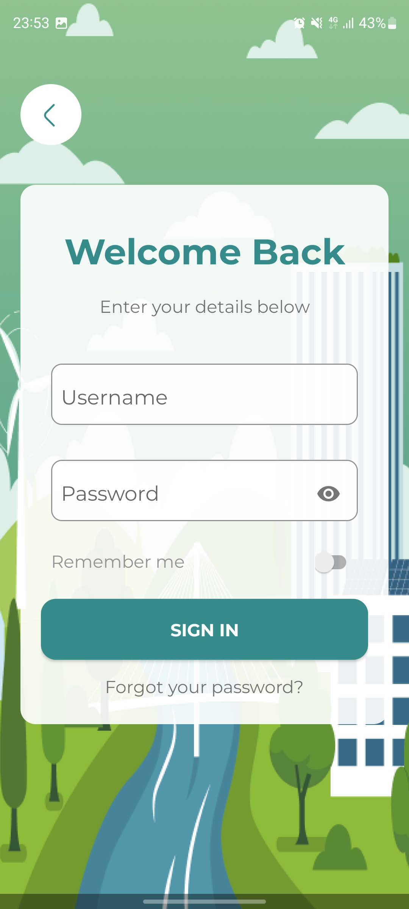
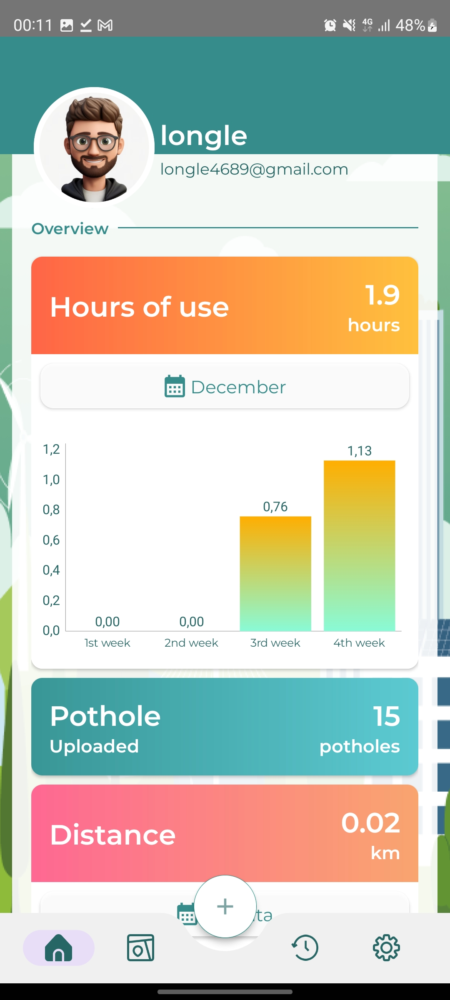
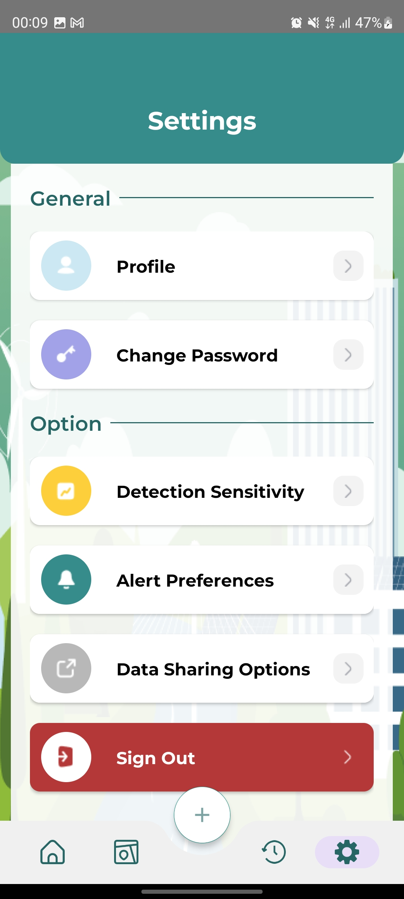
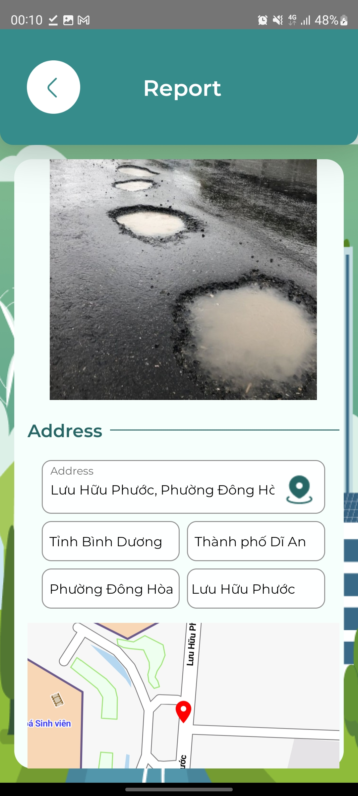

  

# 🚧 PoLoT - Ứng dụng Android

Ứng dụng Android giúp phát hiện **ổ gà (pothole)** trên đường bằng cách sử dụng **cảm biến gia tốc (Accelerometer)** trên thiết bị di động. Mỗi ổ gà được ghi nhận, định vị và gửi về server để phân tích và xây dựng bản đồ cảnh báo ổ gà.

## 🎯 Mục tiêu

- Phát hiện ổ gà khi người dùng di chuyển
- Ghi lại thông tin vị trí, thời gian và phân loại ổ gà
- Gửi dữ liệu lên server qua RESTful API
- Xác thực người dùng bằng email/password hoặc mạng xã hội
- Hỗ trợ quên mật khẩu qua OTP

## 📲 Tính năng chính

### 🔐 Xác thực người dùng

- **Đăng ký / Đăng nhập** bằng email và mật khẩu
- **Đăng nhập bằng Google / Facebook** _(qua API server)_
- **Quên mật khẩu**: gửi mã OTP qua email để đặt lại mật khẩu
- **Xác thực JWT**: token được lưu trong bộ nhớ thiết bị và tự động đính kèm với mỗi request

### 📡 Phát hiện ổ gà

- Sử dụng cảm biến gia tốc để phát hiện ổ gàgà
- Ghi nhận các thông tin:
  - Thời gian sự kiện
  - Tọa độ GPS (nếu được cho phép)
  - Loại ổ gà.
- Tự động gửi thông tin lên ổ gà hoặc thực hiện thủ côngcông
- Gửi lên server Node.js qua REST API

## 🧪 Công nghệ sử dụng

- **Ngôn ngữ:** Java
- **Android SDK**
- **SensorManager** để lấy dữ liệu Accelerometer
- **Retrofit2**: Giao tiếp với RESTful API
- **SharedPreferences** để lưu email và password để tự động đăng nhập.

## 🖼️ Giao diện người dùng (UI)

  
  
  

  
  
  
  
  

